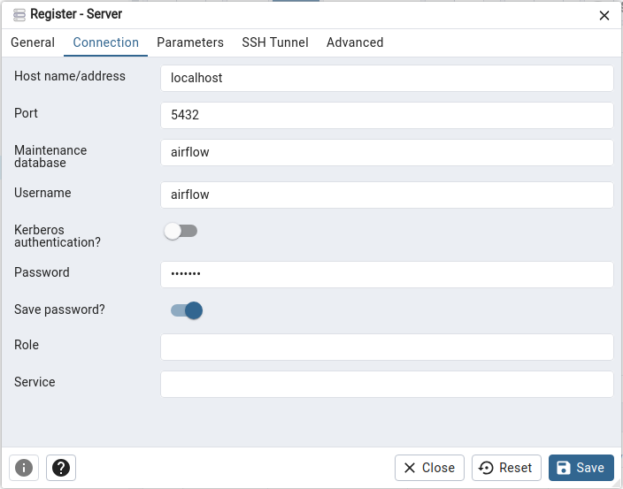

<h2 align="center">mylearn: my Machine Learning framework</h2>

<p align="center">
<a href="https://pypi.org/project/mylearn"></a>
<a href="https://pypi.org/project/mylearn"></a>
<a href="https://github.com/MichaelKarpe/mylearn/blob/main/LICENSE"></a>
<a href="https://github.com/MichaelKarpe/mylearn/actions"></a>
<a href="https://github.com/psf/black"></a>
</p>

___

[mylearn](https://github.com/MichaelKarpe/mylearn) is a Machine Learning framework based on
[Airflow](https://github.com/apache/airflow) and [MLflow](https://github.com/mlflow/mlflow) for designing machine
learning systems in a production perspective.

**Work in progress... Stay tuned!**

# Index

1. [Prerequisites](#prerequisites)
   1. [Recommended software](#recommended-software)
   2. [Install environment](#install-environment)
   3. [Set up PostgreSQL database for Airflow](#set-up-postgresql-database-for-airflow)
   4. [Set up Airflow](#set-up-airflow)
   5. [Set up MLflow](#set-up-mlflow)
2. [Usage (#FIXME)](#usage-fixme)

# Prerequisites

`mylearn` leverages [poetry](https://github.com/python-poetry/poetry) and [poethepoet](https://github.com/nat-n/poethepoet)
to make its installation and setup surprisingly simple. We recommend install and use `mylearn` under a Linux environment
and strictly follow indications provided in this section to avoid any struggle with `mylearn` installation.

## Recommended software

- [Git](https://git-scm.com/downloads)
- [PostgreSQL](https://www.postgresql.org/download/)
- [pgAdmin](https://www.pgadmin.org/download/) (optional)
- [pyenv](https://github.com/pyenv/pyenv/wiki#suggested-build-environment)
    ```
    # Install binary dependencies and build tools
    sudo apt update
    sudo apt install build-essential libssl-dev zlib1g-dev libbz2-dev libreadline-dev libsqlite3-dev curl libncursesw5-dev xz-utils tk-dev libxml2-dev libxmlsec1-dev libffi-dev liblzma-dev

    # Install pyenv
    curl https://pyenv.run | bash
    echo 'export PATH="$HOME/.pyenv/bin:$PATH"' >> ~/.bashrc
    echo 'eval "$(pyenv init -)"' >> ~/.bashrc
    echo 'eval "$(pyenv virtualenv-init -)"' >> ~/.bashrc
    source ~/.bashrc
    
    # Install a Python version and set it as default:
    pyenv install 3.11.6
    pyenv global 3.11.6
    ```
- [poetry](https://python-poetry.org/docs/#installing-with-the-official-installer)
    ```
    curl -sSL https://install.python-poetry.org | python3 -
    echo 'export PATH="~/.local/bin:$PATH"' >> ~/.bashrc
    ```

Once poetry is installed, close and reopen your terminal. We recommended configure `poetry` to install requirements within a `virtualenv` located at the project root level, although not required.
```commandline
poetry config virtualenvs.in-project true
```

## Install environment

Installation is run with:
```commandline
poetry install
```

Should you install from the `requirements.txt` file instead of the `poetry.lock` file:
```commandline
pyenv shell 3.11.6
python -m venv .venv
source .venv/bin/activate
pip install -r requirements.txt
```

## Set up PostgreSQL database for Airflow

Open PostgreSQL command line:
```
sudo -i -u postgres
psql
```

Create `airflow` database with `airflow` user and `airflow` password:
```
CREATE DATABASE airflow;
CREATE USER airflow WITH PASSWORD 'airflow';
GRANT ALL PRIVILEGES ON DATABASE airflow TO airflow;
ALTER DATABASE airflow OWNER TO airflow;
ALTER ROLE airflow WITH CREATEDB;
```

## Set up pgAdmin (optional)

Open pgAdmin, right-click on "Servers" at the top-left and click on "Register > Server".

Then, provide your desired "Name" in the "General" tab, and the following information in the "Connection" tab where:
- "Port" matches the value in the `AIRFLOW__DATABASE__SQL_ALCHEMY_CONN` variable in `pyproject.toml`
- "Maintenance database", "Username" and "Password" match the names defined in the previous subsection
- "Save password" is activated



## Set up Airflow

Airflow is initialized with a single `poe` command
```commandline
poe airflow-init
```

Airflow Scheduler & Webserver can be run with
```commandline
poe airflow-scheduler
poe airflow-webserver
```

Airflow UI can be opened at [localhost:8080](http://localhost:8080), and you can login with username and password `admin`.

If you want to clean your Airflow setup before rerunning `poe airflow-init`, you need to kill Airflow Scheduler &
Webserver and run
```commandline
poe airflow-clean
```

## Set up MLflow (#FIXME)

MLflow UI can be opened at [localhost:5000](http://localhost:5000) after execution of the following command:
```commandline
poe mlflow-ui
```

# Usage (#FIXME)

## MLflow Pipelines Regression Template

The *mlflow-template* pipeline, based on the
[MLflow Pipelines Regression Template](https://github.com/mlflow/mlp-regression-template), can be run independently with
```commandline
poe mlflow-run
```

or via an Airflow Directed Acyclic Graph (DAG) by triggering the *mlflow-template* DAG via Airflow UI or with
```commandline
TO BE COMPLETED
```

## Other examples

**Work in progress... Stay tuned!**
